# Feature Toggle Sdk

## Getting started:

***
# Notes

This `Feature Toggle Sdk` repository contains an SDK developed in Java 8 that provides classes and configurations for using
Unleash with toggle names, tenants, companies, and even with custom fields. To set up the `Feature Toggle Sdk` repository, follow
these steps:

**if you want to compile and use the SDK in local:**
1. Clone the repository.
2. Open a terminal or command prompt and navigate to the cloned repository's directory.
3. Build and publish the SDK to the local Maven repository by running the following command:

**don't forget to set java8 for build sdk**

```shell
# If you have sdk man:

sdk use java 8.332.08.1 // or similar
```

Load the wrapper:
```shell
gradle wrapper
```

Publish sdk to local repo
This command will create a JAR file in the local `.m2` repository.

```shell
./gradlew clean build publishToMavenLocal --info
```

Publish sdk to nexus repo (can omit this step if you don't use nexus)
```shell
# if you set your credentials in gradle-dev.properties or in build.gradle (not recommended)
./gradlew clean build publish --info

# or you can set your credential in gitlab GUI for env vars  
NEXUS_USER=user
NEXUS_PASSWORD=pass
NEXUS_URL=http://nexus.sde.company.solutions:8081/repository/maven-snapshots/
./gradlew clean build publish -Pusername="${NEXUS_USER}" -Ppassword="${NEXUS_PASSWORD}" -Purl="${NEXUS_URL}" --info
```

## 

***

## Installation of the company feature flag sdk in a microservice with java:

- Example adding company sdk from nexus for maven applications:

Add this dependency in your pom configuration:

```xml
<dependency>
   <groupId>com.company.feature-toggles</groupId>
   <artifactId>company-feature-toggles-sdk</artifactId>
   <version>1.0-SNAPSHOT</version>
</dependency>
```

For gradle
```groovy
dependencies {
    implementation 'com.company.feature-toggles:company-feature-toggles-sdk:1.0-SNAPSHOT'
}
```

**For Maven: you should to configure a settings.xml with the nexus repository access:**

link to [settings.xml](extras/maven/settings.xml)

Run build application (mvn or gradle) and check if the sdk is already downloaded

```File Path:
~/.m2/repository
└── com
    └── company
        └── feature-toggles
            └── company-feature-toggles-sdk
                └── 1.0-SNAPSHOT        
```

## Mode of Use

1. Set the `scanBasePackages` in your `MainApplication` class:

Note: Note that  com.project is the actual application (not the sdk)

```java
@SpringBootApplication(scanBasePackages = {"com.project", "com.company"})
public class MainApplication {
    public static void main(String[] args) {
        SpringApplication.run(MainApplication.class, args);
    }
}
```

2. Set the following properties in your application properties or application.yml.
   Set the necessary configuration for db, unleash (or the tool you use) etc:

```yaml
feature:
   toggle:
      apiUrl: http://localhost:4242/api
      appName: app-name2 # this value is overriden by the client 
      clientSecret: "default:development.1ee5fb49a9f0f124853a2deee73a2da98d0ee36846ea400eff06e1fc"
      instanceId: "1"
      service: "unleash" #"fakeFeatureFlag" vs unleash
```

**_Important: appName is the name of the microservice, and is the map of the toggle_**

### Description of every item:

```json
apiUrl: URL of the feature flag server.
appName: Name of the microservice.
clientSecret: Credential access (develop, prod, etc).
instanceId: default to 1.
service: Name of the tool, we can use unleash and interact with the server or simply use a mock setting "fakeFeatureFlag" instead of "unleash" for local development (the fake always returns true).
```

Example:
link to [application-local.yml](src/main/resources/application-dev.yml)

3. Recommended use of the service:

a. Inject the FeatureToggleService and UnleashConfiguration into your service class:

```java
@Service
public class YourServiceClass {

    private final FeatureToggleService featureToggleService;
    private final UnleashFeatureToggleService unleashService;
    
    public YourServiceClass(RepositoryX repo,
                            FeatureToggleService toggleService,
                            UnleashFeatureToggleService unleashService) {
        this.movieRepository = movieRepository;
        this.featureToggleService = toggleService;
        this.unleashService = unleashService;
    }

    public List<Algo> getByTenantAndCompany(String tenantId, String companyId) {
        boolean toggleIsActive = featureToggleService.isFeatureToggleActive(
                TogglesNamesEnum.TENANT_COMPANY_TOGGLE,
                new FeatureContextImpl(tenantId, companyId));

        return process(toggleIsActive);
    }
}
```

b. If needed, you can create your own ToggleEnum for custom properties and toggles names:

```java
public enum ToggleAdHoc implements TogglesNames {
   FLAG_NAME_TOGGLE("FLAG_NAME_TOGGLE"),
   ANOTHER_FLAG_NAME_TOGGLE("ANOTHER_FLAG_NAME_TOGGLE");

    private final String toggleName;

    ToggleAdHoc(String toggleName) {
        this.toggleName = toggleName;
    }

    @Override
    public String getToggleName() {
        return toggleName;
    }
}
```

**_Note: The name of the toggle is the same (exactly) as figure in unleash server_**

c. Use the custom enum toggle in your service:

```java
public List<Algo> getByTenantAndCompany(String tenantId, String companyId) {
    boolean toggleIsActive = unleashConfiguration.unleash().isFeatureToggleActive(
            ToggleAdHoc.FLAG_NAME_TOGGLE,
            new FeatureContextImpl(tenantId, companyId));

    return process(toggleIsActive);
}
```


d. Use the custom toggle with new properties in your service:

Note this is a custom implementation (every property depends of the conf name in unleash)

```java
public List<Algo> getByTenantAndCompanyWithCustomProperties(String userId, String property1, String property2) {
    boolean toggleIsActive = unleashConfiguration.unleash().isFeatureToggleActive(
            ToggleAdHoc.ANOTHER_FLAG_NAME_TOGGLE,
            Map.of(
                    "userId", userId, 
                    "someProperty1", property1, 
                    "someProperty2", property2
        ));

    return process(toggleIsActive);
}
```

**_Note: Replace YourServiceClass with the actual name of your service class._**

***
## Optional: Special Cases
_**If you plan to extend your configuration or you need to adapt it to another feature flag tool**_

(**Optional**) In your application create a config folder with:

```Folder Structure:
└── config
    ├── toggles
    │   └── FeatureToggleConfiguration.java
    └── unleash
        └── UnleashConfiguration.java
```

link to [FeatureToggleConfiguration.java](src/main/java/com/company/config/toggles/FeatureToggleConfiguration.java)

link to [UnleashConfiguration.java](src/main/java/com/company/config/unleash/UnleashConfiguration.java)

## Compile your application (and download the sdk from Nexus repository in your project):

```shell
./mvnw clean package 
# or (nexus optional step)
./mvnw clean package -X -Dile=company-feature-toggles-sdk-1.0.jar -DgroupId=com.company.feature-toggles -DartifactId=company-feature-toggles-sdk -Dversion=1.0-SNAPSHOT -Dpackaging=jar -DrepositoryId=nexus -Durl=http://nexus.sde.company.solutions:8081/repository/maven-snapshots/ -s ~/.m2/settings.xml
```

**For Gradle: you should modify your build.gradle:**

```groovy
repositories {
   mavenCentral() // This is the default Maven Central repository, you can remove it if you want to use only the custom Nexus repository
   maven {
      url 'http://nexus.sde.company.solutions:8081/repository/maven-snapshots/' (optional)
   }
}
// ...
dependencies {
   implementation 'com.company:feature-toggle-sdk:1.0-SNAPSHOT'
}

...
repositories {
   maven {
      name = 'nexus'
      allowInsecureProtocol = true
      url = repoUrl
      credentials {
         username = repoUser //'your-nexus-username'
         password = repoPassword //'your-nexus-password'
      }
      // Uncomment the following line to disable SSL verification (not recommended for production use)
      // sslVerificationEnabled = false
   }
}
```

And run

```shell
# if you dont have gradlew
gradle wrapper
# and then
./gradlew clean build --info
```


If everything is ok, you should see the sdk already downloaded

```File Path:
~/.m2/repository
└── com
    └── company
        └── feature-toggles
            └── company-feature-toggles-sdk
                └── 1.0-SNAPSHOT
                    └── company-feature-toggles-sdk-1.0-20230719.134601-2.jar
```

## Usage Unleash:

1. Create token:

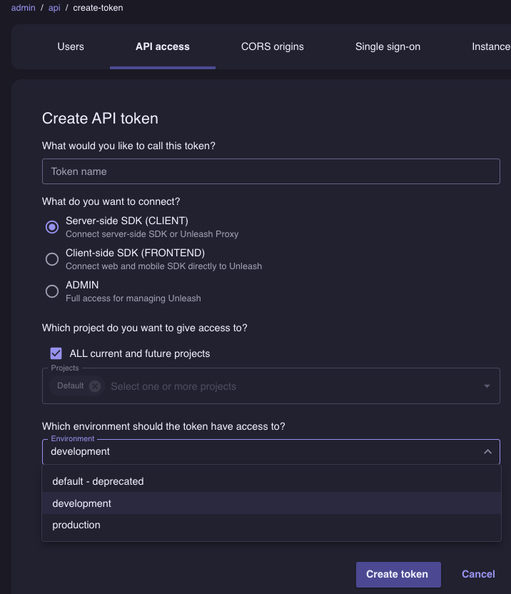

```shell
Example
default:development.1ee5fb49a9f0f124853a2deee73a2da98d0ee36846ea400eff06e1fc
```

2. Create toggle

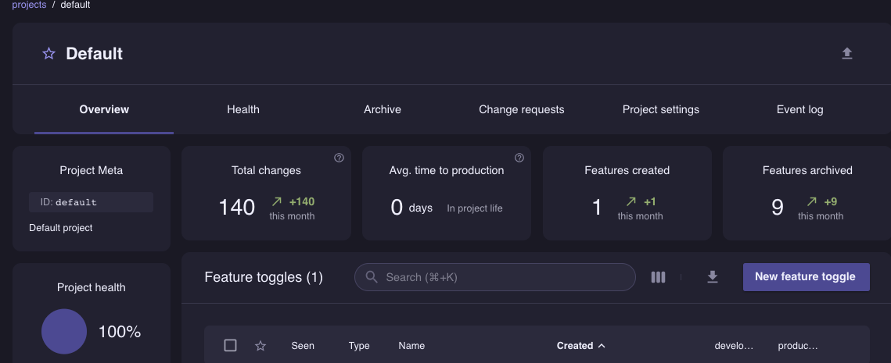

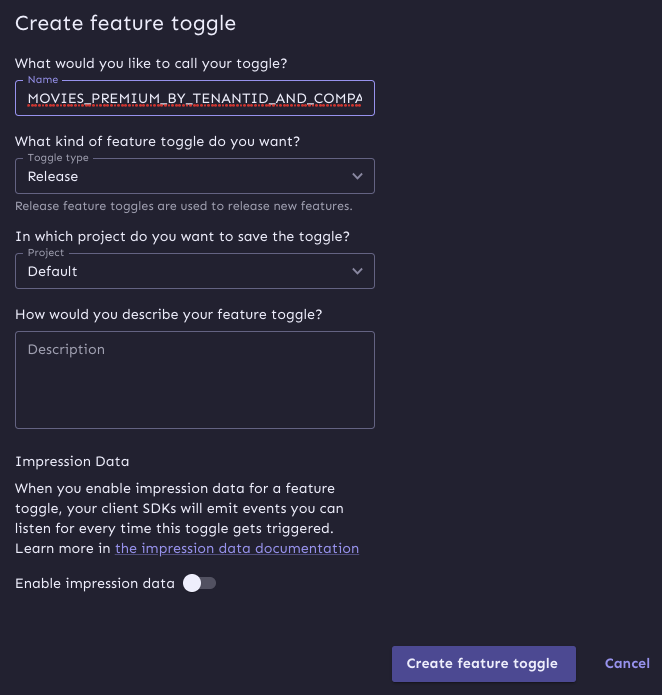

## Suggested format for naming a toggle: (for movie app demo)


```NAME_OF_THE_APPLICATION_USE``` : Examples

- More examples:
- ```MOVIES_PREMIUM_BY_TENANTID```
- ```MOVIES_PREMIUM_BY_TENANTID_AND_COMPANYID```
- ```MOVIES_PREMIUM_BY_TRIAL```

3. Create context

- Create context:  (tenant, tenant+companyId)

a. 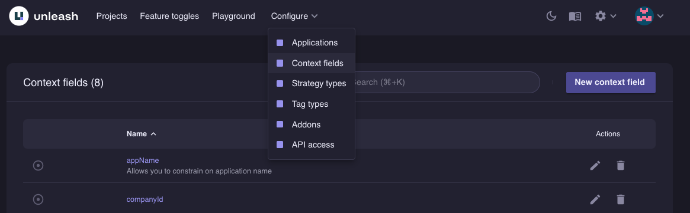
b. 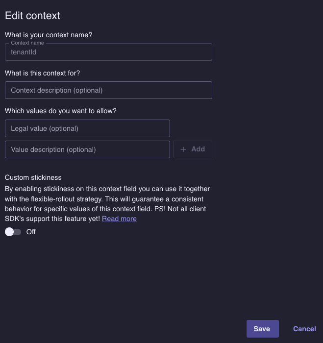


4. Create strategy with custom fields:
   **Dont create a custom strategy, soon would be deprecated, use the available strategies with custom fields instead:**

- Select the toggle.
- Select in add Strategy
- Select default Strategy

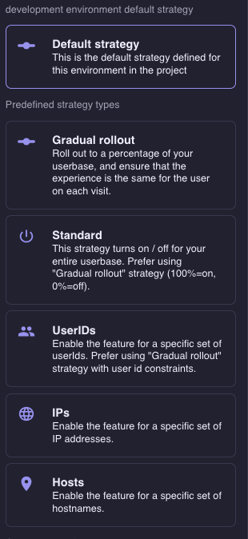

Note that the name of the strategy is optional.

### The first constraint is mandatory, that constraint is for map the toggle and the constraint to an specific microservice.

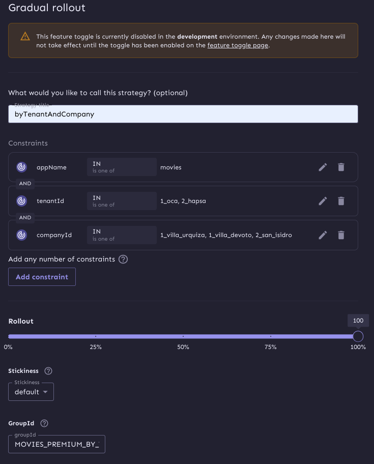

- You can have more than one constraint for the same toggle.
- Note the first constraint, map the name of the microservice setting in application.yml to that toggle (make sure the name is the same as the microservice name).

The last toggle and strategy apply for:
- MOVIES_PREMIUM_BY_TENANTID_AND_COMPANYID
- With 3 constraints:
- - appName: movie microservice
- - tenantId: id of the tenant, in this case for oca client
- - companyId: id of the company, in this case locations of the last tenant already mention.

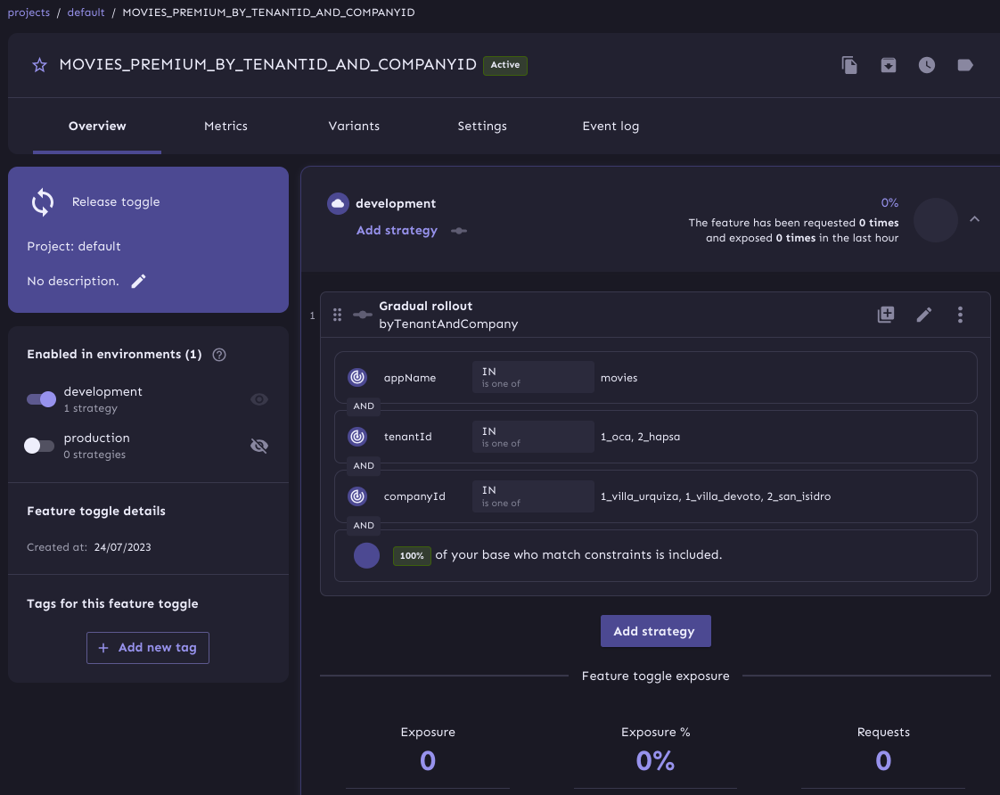


NOTE: Now you should use that name in your code code for refer to the toggle.

```java
public enum ToggleAdHoc implements TogglesNames {
    CUSTOM_TENANT_COMPANY_TOGGLE_NAME("MOVIES_PREMIUM_BY_TENANTID_AND_COMPANYID"),
    CUSTOM_TENANT_TOGGLE_NAME("otherTenantToggle");

    private final String toggleName;

    ToggleAdHoc(String toggleName) {
        this.toggleName = toggleName;
    }

    @Override
    public String getToggleName() {
        return toggleName;
    }
}
```


**Test Rules example:**

| ToggleName                                                 | Description                                                                                                              |
|------------------------------------------------------------|--------------------------------------------------------------------------------------------------------------------------|
| MOVIES_PREMIUM_BY_TENANTID_AND_COMPANYID                   | 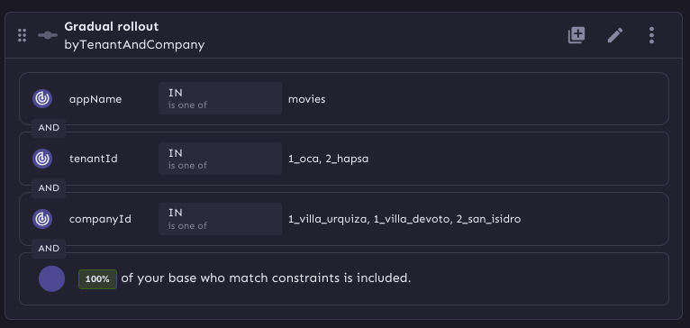 |
| ~~premiumByTenant~~ (Warning: Name and generic constraint) | 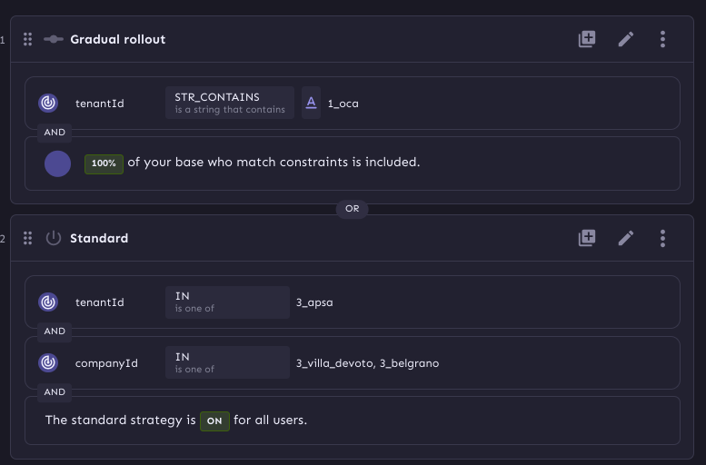                                                     |
| ~~otherTenantToggle~~ (Warning: Name and generic constraint)                                | 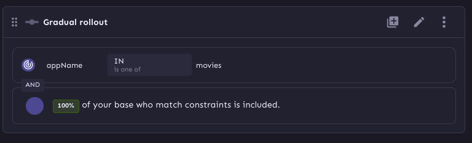                                               |
| ~~para_app_name~~ (Warning: Name and generic constraint)                                    | 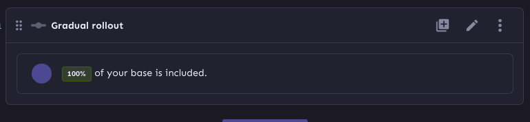                                                       |


## Test toggles


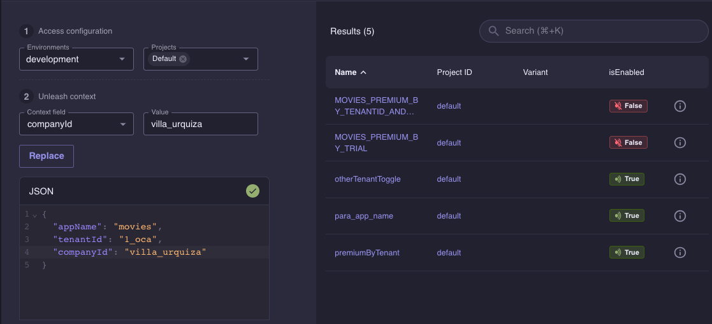

**_WARNING:Note the result of cross toggles rules_**

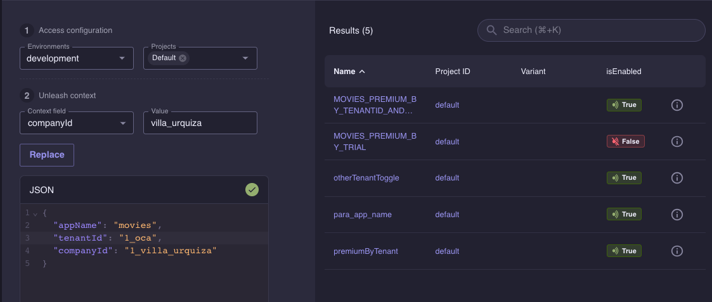

**_Note now MOVIES_PREMIUM_BY_TENANTID_AND_COMPANYID toggle is true, but there are some toggles with a positive result_**


## OPTIONAL
## install and Configure Unleash for local development
## Installation

To configure Unleash and create the necessary toggle names and custom fields in an local environment, follow these steps:

1. Start the Unleash server using Docker Compose. Create a `docker-compose.yml` file with the following content:

```yaml
version: '3.4'
services:
  postgres-unleash:
    image: postgres:13
    container_name: postgres-unleash
    environment:
      - POSTGRES_USER=unleash_user
      - POSTGRES_PASSWORD=password
      - POSTGRES_DB=unleash
    volumes:
      - unleash:/data/postgres
    networks:
      - unleash
    restart: unless-stopped

  unleash-server:
    image: unleashorg/unleash-server:latest
    container_name: unleash-server
    environment:
      - DATABASE_HOST=postgres-unleash
      - DATABASE_NAME=unleash
      - DATABASE_USERNAME=unleash_user
      - DATABASE_PASSWORD=password
      - LOG_LEVEL=INFO
      - DATABASE_SSL=false
    depends_on:
      - postgres-unleash
    networks:
      - unleash
    ports:
      - "4242:4242"
    tty: false

networks:
  unleash:
    driver: bridge

volumes:
  unleash:
```

1. Open a terminal or command prompt and navigate to the directory containing the docker-compose.yml file.
2. Start the Unleash server by running the following command:

```shell
docker-compose up -d
```

Open an explorer to configure unleash server:


```shell
# Example local 
http://localhost:4242/admin/api
```

## Support
**https://github.com/fernando-dm**
